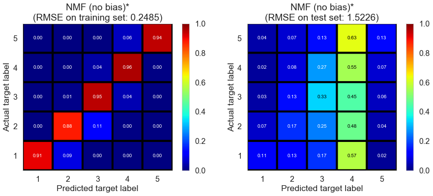

## Contents
{:.no_toc}
*  
{: toc}

## Introduction

Collaborative filtering predicts ratings based on past user behavior, which is characterized by previous ratings in this case. To perform collaborative filtering, we only need to use restaurant ratings from each user. We acquire data for this part by keeping 3 features in `review` table, `user_id`, `business_id`, and `stars`.

Collaborative filtering includes 2 primary areas, **neighborhood methods** and **latent factor models**. In this part, we tested several baseline models, neighborhood methods and latent factor models. We implemented some baseline models and latent factor models from scratch (by using `numpy` and `scipy`'s linear algebra toolkits instead of well-established recommender system packages); we implemented other algorithms by wrapping around methods in a recommender system python package, [`scikit-surprise`](http://surpriselib.com/). Each algorithm we implemented by using the [`scikit-surprise`](http://surpriselib.com/) package is indicated by a * after its name.

Here, we use Champaign dataset (20571 reviews, 878 restaurants, 8451 users) for demo purpose.

We randomly split the reviews into 3 sets: a training set (60%), a cross-validation set (16%) and a test set (24%). We train base estimators on the training set, and test on the test set; cross-validation set is used for the training of ensemble estimators later.

For each model, we report root mean square error (RMSE) and $R^2$ score on training set and test set. To gain some insight on model's performance on different ratings, we round predicted ratings, where predicted ratings below 1 are rounded to 1 and predicted ratings above 5 are round to 5, and plot the confusion matrix of training set and test set (in a format used in [a related work](https://github.com/kevin11h/YelpDatasetChallengeDataScienceAndMachineLearningUCSD/blob/master/Yelp%20Predictive%20Analytics.ipynb)).
   

## Baseline models

We first built some baseline models, including **mode estimator**, **normal predictor\***, **baseline (mean)**, **baseline (regression)**, and **baseline (ALS)\***.

### Mode estimator

Inspired by the fact that most ratings are 5 from EDA part, we build a mode estimator, which predicts every rating as the mode value of all ratings.

<table  class="dataframe">
  <thead>
    <tr style="text-align: left;">
      <th>model</th>
      <th>fitting time (s)</th>
      <th>train RMSE</th>
      <th>test RMSE</th>
      <th>train $R^2$</th>
      <th>test $R^2$</th>
    </tr>
  </thead>
  <tbody>
    <tr>
      <td>Mode estimator</td>
      <td>0.0</td>
      <td>1.9995</td>
      <td>2.0258</td>
      <td>-0.9501</td>
      <td>-0.95</td>
    </tr>
  </tbody>
</table>

As we mentioned earlier, we could plot a confusion matrix to gain some insight on model's performance on different ratings by rounding the predicted ratings, setting predictions below 1 to 1, above 5 to 5, and using a format used in [a related work](https://github.com/kevin11h/YelpDatasetChallengeDataScienceAndMachineLearningUCSD/blob/master/Yelp%20Predictive%20Analytics.ipynb) (the same below).

We plot the confusion matrix for training set on the left, and that for test set on the right (the same below).

    

The performance of mode estimator is poor as indicated by negative $R^2$, which is not surprising.
   

### Normal predictor*
We implemented this algorithm by wrapping around [`NormalPredictor`](http://surprise.readthedocs.io/en/stable/basic_algorithms.html#surprise.prediction_algorithms.random_pred.NormalPredictor) in the [`scikit-surprise`](http://surpriselib.com/) package.

As described in the [documentation](http://surprise.readthedocs.io/en/stable/basic_algorithms.html#surprise.prediction_algorithms.random_pred.NormalPredictor),
>**Normal predictor\*** assumes the distribution of the training set to be normal, which doesn't hold in this case. The prediction $\hat{r}_{ui}$ is generated from a normal distribution $\mathcal{N}(\hat{\mu}, \hat{\sigma}^2)$ where $\hat{\mu}$ and $\hat{\sigma}$ are estimated from the training data using the Maximum Likelihood Estimation:
>
>$$\hat{\mu} = \frac{1}{|R_{train}|} \sum_{r_{ui} \in R_{train}} r_{ui}$$
>
>$$\hat{\sigma} = \sqrt{\sum_{r_{ui} \in R_{train}}\frac{(r_{ui} - \hat{\mu})^2}{|R_{train}|}}$$

The result is shown below.

<table  class="dataframe">
  <thead>
    <tr style="text-align: left;">
      <th>model</th>
      <th>fitting time (s)</th>
      <th>train RMSE</th>
      <th>test RMSE</th>
      <th>train $R^2$</th>
      <th>test $R^2$</th>
    </tr>
  </thead>
  <tbody>
    <tr>
      <td>Normal predictor*</td>
      <td>0.051</td>
      <td>1.8685</td>
      <td>1.8784</td>
      <td>-0.7029</td>
      <td>-0.6767</td>
    </tr>
  </tbody>
</table>

    

The performance of normal predictor is also very poor since rating do NOT satisfy normal distribution (as shown in EDA).
   

### Baseline (mean)

Here we assume much of variation in observed ratings comes from effects associated with either users or items, known as biases (as assumed in most [latent factor models](https://datajobs.com/data-science-repo/Recommender-Systems-%5BNetflix%5D.pdf)). We estimate the ratings as:

$$\hat{r}_{ui} = \mu + b_u + b_i$$

In this model, we estimate biases with sample averages:

$$\hat{b}_u = \bar{r}_u - \mu$$

$$\hat{b}_i = \bar{r}_i - \mu$$

where $\bar{r}_u$ and $\bar{r}_i$ represent average ratings of user $u$ and restaurant $i$ repsectively, $b_u$ and $b_i$ represent the biases of user $u$ and restaurant $i$ repsectively from some intercept parameter $\mu$, which is estimated by the whole sample average in this case.

When we make predictions, if user $u$ is unknown, the bias $b_u$ is assumed to be zero; if the restaurant $i$ is unknown, the bias $b_i$ is assumed to be zero.

<table  class="dataframe">
  <thead>
    <tr style="text-align: left;">
      <th>model</th>
      <th>fitting time (s)</th>
      <th>train RMSE</th>
      <th>test RMSE</th>
      <th>train $R^2$</th>
      <th>test $R^2$</th>
    </tr>
  </thead>
  <tbody>
    <tr>
      <td>Baseline (mean)</td>
      <td>0.021</td>
      <td>0.9485</td>
      <td>1.4648</td>
      <td>0.5612</td>
      <td>-0.0195</td>
    </tr>
  </tbody>
</table>

    

Baseline (mean) performs well on training set; however, it suffers from overfitting as indicated by negative $R^2$ on test set, which is presumably due to the fact that there is no regularization in this model.
   

### Baseline (regression)

Similarly, we estimate the ratings as:

$$\hat{r}_{ui} = \mu + b_u + b_i$$

In this model, we estimate biases of users and restaurants using regularized regression.  
Specifically, we minimize the following regularized squared error:

$$\sum_{r_{ui} \in R_{train}} \left(r_{ui} - (\mu + b_u + b_i)\right)^2 +
\lambda \left(b_u^2 + b_i^2 \right).$$

We perform one-hot encoding on `user_id` and `business_id`, and store the corresponding design matrix as a [sparse matrix](https://docs.scipy.org/doc/scipy/reference/sparse.html). And we solve the Ridge regression algorithm using [LSMR](https://docs.scipy.org/doc/scipy-0.14.0/reference/generated/scipy.sparse.linalg.lsmr.html).

When we make predictions, if user $u$ is unknown, the bias $b_u$ is assumed to be zero; if the restaurant $i$ is unknown, the bias $b_i$ is assumed to be zero.

We performed 2 rounds of cross-validation to determine the best regularization term $\lambda$.

We can test the performance of baseline (regression) using the best regularization parameter determined by the cross-validation.

<table  class="dataframe">
  <thead>
    <tr style="text-align: left;">
      <th>model</th>
      <th>fitting time (s)</th>
      <th>train RMSE</th>
      <th>test RMSE</th>
      <th>train $R^2$</th>
      <th>test $R^2$</th>
    </tr>
  </thead>
  <tbody>
    <tr>
      <td>Baseline (regression)</td>
      <td>0.027</td>
      <td>1.0481</td>
      <td>1.3032</td>
      <td>0.4642</td>
      <td>0.193</td>
    </tr>
  </tbody>
</table>

    

As we can see, baseline (regression) predicts most ratings to be 3 or 4. The performance of this model is significantly better than previous baseline models, as indicated by larger $R^2$.
   

### Baseline (ALS)*

We implemented this algorithm by wrapping around [`BaselineOnly`](http://surprise.readthedocs.io/en/stable/basic_algorithms.html#surprise.prediction_algorithms.baseline_only.BaselineOnly) in the [`scikit-surprise`](http://surpriselib.com/) package.

Here we also estimate ratings as:

$$\hat{r}_{ui} = \mu + b_u + b_i$$

And we minimize the same regularized squared error:

$$\sum_{r_{ui} \in R_{train}} \left(r_{ui} - (\mu + b_u + b_i)\right)^2 +
\lambda \left(b_u^2 + b_i^2 \right).$$

Rather than applying one-hot encoding on `user_id` and `business_id` simultaneously, alternating least squares (ALS), which is the [default algorithm](http://surprise.readthedocs.io/en/stable/prediction_algorithms.html#baseline-estimates-configuration) used in [`BaselineOnly`](http://surprise.readthedocs.io/en/stable/basic_algorithms.html#surprise.prediction_algorithms.baseline_only.BaselineOnly), is used here for minimizing the regularized squared error.

When we make predictions, if user $u$ is unknown, the bias $b_u$ is assumed to be zero; if the restaurant $i$ is unknown, the bias $b_i$ is assumed to be zero.

We use the default parameters, and the result is shown below.

    Estimating biases using als...

<table  class="dataframe">
  <thead>
    <tr style="text-align: left;">
      <th>model</th>
      <th>fitting time (s)</th>
      <th>train RMSE</th>
      <th>test RMSE</th>
      <th>train $R^2$</th>
      <th>test $R^2$</th>
    </tr>
  </thead>
  <tbody>
    <tr>
      <td>Baseline (ALS)*</td>
      <td>0.061</td>
      <td>1.1981</td>
      <td>1.32</td>
      <td>0.2998</td>
      <td>0.1721</td>
    </tr>
  </tbody>
</table>

    

The performance on the test set is similar with baseline (regression), while it is worse on the training set, indicating the variance of the model is similar but the bias is higher.
   

## Latent factor models

Here we tried several matrix factorization-based algorithms, including several different implementations of singular value decomposition ([SVD](https://datajobs.com/data-science-repo/Recommender-Systems-%5BNetflix%5D.pdf)) and non-negative matrix factorization ([NMF](http://ieeexplore.ieee.org/document/6748996/)).

### SVD-ALS1

We first implemented sigular value decomposition via alternating least squares ([SVD-ALS](https://datajobs.com/data-science-repo/Recommender-Systems-%5BNetflix%5D.pdf)).

We estimate ratings as:

$$\hat{r}_{ui} = \mu + b_u + b_i + q_i^Tp_u$$

where $p_u$ represents the latent factors associated with user $u$, and $q_i$ represents the latent factors associated with restaurant $i$.

And we minimize the following regularized squared error:

$$\sum_{r_{ui} \in R_{train}} \left(r_{ui} - \hat{r}_{ui} \right)^2 +
\lambda\left(b_i^2 + b_u^2 + ||q_i||^2 + ||p_u||^2\right)$$

Two widely used algorithms for solving the above problem are stochastic gradient descent ([SGD](https://en.wikipedia.org/wiki/Stochastic_gradient_descent)) and alternating least squares ([ALS](https://datajobs.com/data-science-repo/Recommender-Systems-%5BNetflix%5D.pdf)).

We implement **SVD-ALS1** as follows:
1. Fit a baseline (regression) model with optimized regularization term to learn $\mu$, $b_u$, and $b_i$.
2. Initialize $p_u$ by randomly generating values from a set of IID normal distributions with user defined `init_mean` and `init_std`.
3. In each iteration, we first solve regularized least squares problem for $q_i$ by fixing $p_u$, and then solve for $p_u$ by fixing $q_i$. Specifically, we don't update biases $b_u$ or $b_i$ in each iteration in **SVD-ALS1**. We use [LSMR](https://docs.scipy.org/doc/scipy-0.14.0/reference/generated/scipy.sparse.linalg.lsmr.html) to solve regularized least squares problem in each iteration.

When we make predictions, if user $u$ is unkown, then the bias $b_u$ and the factors $p_u$ are assumed to be zero; if restaurant $i$ is unknown, the bias $b_i$ and the factors $q_i$ are assumed to be zero.

We can gain some intuition about the impact of the number of iterations and the number of latent factors on the training and test performance before determining the best parameters through cross-validation.

The performance on the training set improves significantly compared to baseline (regression) model when the number of iterations and the number of latent factors are not too small; the performance on the test set doesn't change much.

We can determine the best parameters through cross-validation. And we can test the performance of the algorithm on our dataset.

<table  class="dataframe">
  <thead>
    <tr style="text-align: left;">
      <th>model</th>
      <th>fitting time (s)</th>
      <th>train RMSE</th>
      <th>test RMSE</th>
      <th>train $R^2$</th>
      <th>test $R^2$</th>
    </tr>
  </thead>
  <tbody>
    <tr>
      <td>SVD-ALS1</td>
      <td>12.3007</td>
      <td>0.6747</td>
      <td>1.3064</td>
      <td>0.778</td>
      <td>0.1891</td>
    </tr>
  </tbody>
</table>

    

The performance on the test set doesn't change much but the performance on the training set improves significantly compared to baseline (regression) model. **SVD-ALS1** significantly decreases the bias of the model without significantly increasing the variance. 
   

### SVD-ALS2

Different from **SVD-ALS1**, **SVD-ALS2** updates biases $b_u$ or $b_i$ in each iteration.

We estimate ratings as:

$$\hat{r}_{ui} = \mu + b_u + b_i + q_i^Tp_u$$

where $p_u$ represents the latent factors associated with user $u$, and $q_i$ represents the latent factors associated with restaurant $i$.  
And we minimize the following regularized squared error:

$$\sum_{r_{ui} \in R_{train}} \left(r_{ui} - \hat{r}_{ui} \right)^2 +
\lambda\left(b_i^2 + b_u^2 + ||q_i||^2 + ||p_u||^2\right)$$

We implement **SVD-ALS2** as follows:
1. Fit a baseline (regression) model with optimized regularization term to learn $\mu$, $b_u$, and $b_i$.
2. Initialize $p_u$ by randomly generating values from a set of IID normal distributions with user defined `init_mean` and `init_std`.
3. In each iteration, we first solve regularized least squares problem for $q_i$ and $b_i$ by fixing $p_u$ and $b_u$, and then solve for $p_u$ and $b_u$ by fixing $q_i$ and $b_i$. Specifically, we update biases $b_u$ or $b_i$ in each iteration in **SVD-ALS2**. We use [LSMR](https://docs.scipy.org/doc/scipy-0.14.0/reference/generated/scipy.sparse.linalg.lsmr.html) to solve regularized least squares problem at each iteration.

When we make predictions, if user $u$ is unkown, then the bias $b_u$ and the factors $p_u$ are assumed to be zero; if restaurant $i$ is unknown, the bias $b_i$ and the factors $q_i$ are assumed to be zero.

We can determine the best parameters through cross-validation. And we can test the performance of the algorithm on our dataset.

<table  class="dataframe">
  <thead>
    <tr style="text-align: left;">
      <th>model</th>
      <th>fitting time (s)</th>
      <th>train RMSE</th>
      <th>test RMSE</th>
      <th>train $R^2$</th>
      <th>test $R^2$</th>
    </tr>
  </thead>
  <tbody>
    <tr>
      <td>SVD-ALS2</td>
      <td>13.1128</td>
      <td>0.6764</td>
      <td>1.3092</td>
      <td>0.7768</td>
      <td>0.1855</td>
    </tr>
  </tbody>
</table>

    

The result of **SVD-ALS2** is similar to that of **SVD-ALS1**, indicating updating biases in each iteration doesn't have much impact on the model performance.
   

### SVD-SGD*

We implemented this algorithm by wrapping around [`SVD`](http://surprise.readthedocs.io/en/stable/matrix_factorization.html#surprise.prediction_algorithms.matrix_factorization.SVD) in the [`scikit-surprise`](http://surpriselib.com/) package.

Stochastic gradient descent (SGD) is another widely used algorithm for solving SVD problems.

We estimate ratings as:

$$\hat{r}_{ui} = \mu + b_u + b_i + q_i^Tp_u$$

where $p_u$ represents the latent factors associated with user $u$, and $q_i$ represents the latent factors associated with restaurant $i$.

And we minimize the following regularized squared error:

$$\sum_{r_{ui} \in R_{train}} \left(r_{ui} - \hat{r}_{ui} \right)^2 +
\lambda\left(b_i^2 + b_u^2 + ||q_i||^2 + ||p_u||^2\right)$$

As described in [documentation](http://surprise.readthedocs.io/en/stable/matrix_factorization.html#surprise.prediction_algorithms.matrix_factorization.SVD),
>**SVD-SGD\*** performs minization by stachastic gradient descent:
>
>$$b_u \leftarrow b_u + \gamma (e_{ui} - \lambda b_u)$$
>
>$$b_i \leftarrow b_i + \gamma (e_{ui} - \lambda b_i)$$
>
>$$p_u \leftarrow p_u + \gamma (e_{ui} \cdot q_i - \lambda p_u)$$
>
>$$q_i \leftarrow q_i + \gamma (e_{ui} \cdot p_u - \lambda q_i)$$
>
>where $e_{ui} = r_{ui} - \hat{r}_{ui}$.

When we make predictions, if user $u$ is unkown, then the bias $b_u$ and the factors $p_u$ are assumed to be zero; if restaurant $i$ is unknown, the bias $b_i$ and the factors $q_i$ are assumed to be zero.

We use the default parameters, and the result is shown below.

<table  class="dataframe">
  <thead>
    <tr style="text-align: left;">
      <th>model</th>
      <th>fitting time (s)</th>
      <th>train RMSE</th>
      <th>test RMSE</th>
      <th>train $R^2$</th>
      <th>test $R^2$</th>
    </tr>
  </thead>
  <tbody>
    <tr>
      <td>SVD-SGD*</td>
      <td>1.0001</td>
      <td>0.8929</td>
      <td>1.3173</td>
      <td>0.6111</td>
      <td>0.1754</td>
    </tr>
  </tbody>
</table>

    

The result of **SVD-SGD\*** is similar to that of **SVD-ALS1** and **SVD-ALS2**.
   

### SVD++-SGD*

We implemented this algorithm by wrapping around [`SVDpp`](http://surprise.readthedocs.io/en/stable/matrix_factorization.html#surprise.prediction_algorithms.matrix_factorization.SVDpp) in the [`scikit-surprise`](http://surpriselib.com/) package.

As described in [documentation](http://surprise.readthedocs.io/en/stable/matrix_factorization.html#surprise.prediction_algorithms.matrix_factorization.SVDpp),
>**SVD++** algorithm takes into account implicit ratings. The prediction $\hat{r}_{ui}$ is set as:
>
>$$\hat{r}_{ui} = \mu + b_u + b_i + q_i^T\left(p_u +|I_u|^{-\frac{1}{2}} \sum_{j \in I_u}y_j\right)$$
>
>where $y_i$ terms capture implicit ratings; an implicit rating describes the fact that a user $u$ rated a restaurant $j$, regardless of the rating value. 

When we make predictions, if user $u$ is unkown, then the bias $b_u$ and the factors $p_u$ are assumed to be zero; if restaurant $i$ is unknown, $b_i$, $q_i$ and $y_i$ are assumed to be zero.

We use the default parameters, and the result is shown below.

<table  class="dataframe">
  <thead>
    <tr style="text-align: left;">
      <th>model</th>
      <th>fitting time (s)</th>
      <th>train RMSE</th>
      <th>test RMSE</th>
      <th>train $R^2$</th>
      <th>test $R^2$</th>
    </tr>
  </thead>
  <tbody>
    <tr>
      <td>SVD++-SGD*</td>
      <td>3.3182</td>
      <td>0.9285</td>
      <td>1.322</td>
      <td>0.5795</td>
      <td>0.1695</td>
    </tr>
  </tbody>
</table>

    

The inclusion of implicit rating doesn't seem to significantly change model performance.
   

### NMF-SGD*

We implemented this algorithm by wrapping around [`NMF`](http://surprise.readthedocs.io/en/stable/matrix_factorization.html#surprise.prediction_algorithms.matrix_factorization.NMF) in the [`scikit-surprise`](http://surpriselib.com/) package.

As described in the [documentation](http://surprise.readthedocs.io/en/stable/matrix_factorization.html#surprise.prediction_algorithms.matrix_factorization.NMF),
>**NMF** sets the prediction $\hat{r}_{ui}$ as:
>
>$$\hat{r}_{ui} = q_i^Tp_u$$
>
>where $p_u$ and $q_i$ are kept positive.
>
>Each step of SGD updates $p_{uf}$ and $q_{if}$ as follows:
>
>$$p_{uf} \leftarrow p_{uf} \cdot \frac{\sum_{i \in I_u} q_{if}
\cdot r_{ui}}{\sum_{i \in I_u} q_{if} \cdot \hat{r_{ui}} +
\lambda_u |I_u| p_{uf}}$$
>
>$$q_{if} \leftarrow q_{if} \cdot \frac{\sum_{u \in U_i} p_{uf}
\cdot r_{ui}}{\sum_{u \in U_i} p_{uf} \cdot \hat{r_{ui}} +
\lambda_i |U_i| q_{if}}$$

We use the default parameters, and the result is shown below.

<table  class="dataframe">
  <thead>
    <tr style="text-align: left;">
      <th>model</th>
      <th>fitting time (s)</th>
      <th>train RMSE</th>
      <th>test RMSE</th>
      <th>train $R^2$</th>
      <th>test $R^2$</th>
    </tr>
  </thead>
  <tbody>
    <tr>
      <td>NMF (no bias)*</td>
      <td>1.2431</td>
      <td>0.2485</td>
      <td>1.5226</td>
      <td>0.9699</td>
      <td>-0.1016</td>
    </tr>
  </tbody>
</table>

    

The model suffers from serious overfitting, partially because we doesn't add bias term.

We can try the biased version of **NMF**, which sets the prediction as

$$\hat{r}_{ui} = \mu + b_u + b_i + q_i^Tp_u.$$

The result is shown below.

<table  class="dataframe">
  <thead>
    <tr style="text-align: left;">
      <th>model</th>
      <th>fitting time (s)</th>
      <th>train RMSE</th>
      <th>test RMSE</th>
      <th>train $R^2$</th>
      <th>test $R^2$</th>
    </tr>
  </thead>
  <tbody>
    <tr>
      <td>NMF (with bias)*</td>
      <td>1.1971</td>
      <td>0.4773</td>
      <td>1.4985</td>
      <td>0.8889</td>
      <td>-0.067</td>
    </tr>
  </tbody>
</table>

    

It is better than the version without bias terms, but the model still suffers from overfitting. Although we could potentially address the issue by tuning regularization parameters, the result suggests it might not be a good idea to use **NMF** in this case.
   

## Neighborhood methods

In this part, we tried some neighborhood methods available in the [`scikit-surprise`](http://surpriselib.com/) package. Neighborhood methods don't perform well in this dataset in general since a lot of users and restaurants don't have any neighbors, making the models susceptible to overfitting.

### k-NN (basic)*

We implemented this algorithm by wrapping around [`KNNBasic`](http://surprise.readthedocs.io/en/stable/knn_inspired.html#surprise.prediction_algorithms.knns.KNNBasic) in the [`scikit-surprise`](http://surpriselib.com/) package.

As described in the [documentation](http://surprise.readthedocs.io/en/stable/knn_inspired.html#surprise.prediction_algorithms.knns.KNNBasic), 
>**k-NN (basic)\*** sets the prediction as:
>
>$$\hat{r}_{ui} = \frac{
\sum\limits_{v \in N^k_i(u)} \text{sim}(u, v) \cdot r_{vi}}
{\sum\limits_{v \in N^k_i(u)} \text{sim}(u, v)}$$
>
>or
>
>$$\hat{r}_{ui} = \frac{
\sum\limits_{j \in N^k_u(i)} \text{sim}(i, j) \cdot r_{uj}}
{\sum\limits_{j \in N^k_u(j)} \text{sim}(i, j)}$$

We use the default parameters, and the result is shown below.

    Computing the msd similarity matrix...
    Done computing similarity matrix.

<table  class="dataframe">
  <thead>
    <tr style="text-align: left;">
      <th>model</th>
      <th>fitting time (s)</th>
      <th>train RMSE</th>
      <th>test RMSE</th>
      <th>train $R^2$</th>
      <th>test $R^2$</th>
    </tr>
  </thead>
  <tbody>
    <tr>
      <td>KNN (basic)*</td>
      <td>1.0001</td>
      <td>0.4328</td>
      <td>1.4642</td>
      <td>0.9086</td>
      <td>-0.0187</td>
    </tr>
  </tbody>
</table>

    

The model suffers from overfitting as we expected.
   

### k-NN (with means)*

We implemented this algorithm by wrapping around [`KNNWithMeans`](http://surprise.readthedocs.io/en/stable/knn_inspired.html#surprise.prediction_algorithms.knns.KNNWithMeans) in the [`scikit-surprise`](http://surpriselib.com/) package.

As described in the [documentation](http://surprise.readthedocs.io/en/stable/knn_inspired.html#surprise.prediction_algorithms.knns.KNNWithMeans), 
>**k-NN (with means)\*** takes into account the average ratings of each user, and sets the prediction as:
>
>$$\hat{r}_{ui} = \mu_u + \frac{ \sum\limits_{v \in N^k_i(u)}
\text{sim}(u, v) \cdot (r_{vi} - \mu_v)} {\sum\limits_{v \in
N^k_i(u)} \text{sim}(u, v)}$$
>
>or
>
>$$\hat{r}_{ui} = \mu_i + \frac{ \sum\limits_{j \in N^k_u(i)}
\text{sim}(i, j) \cdot (r_{uj} - \mu_j)} {\sum\limits_{j \in
N^k_u(i)} \text{sim}(i, j)}$$

We use the default parameters, and the result is shown below.

    Computing the msd similarity matrix...
    Done computing similarity matrix.

<table  class="dataframe">
  <thead>
    <tr style="text-align: left;">
      <th>model</th>
      <th>fitting time (s)</th>
      <th>train RMSE</th>
      <th>test RMSE</th>
      <th>train $R^2$</th>
      <th>test $R^2$</th>
    </tr>
  </thead>
  <tbody>
    <tr>
      <td>KNN (with means)*</td>
      <td>1.1161</td>
      <td>0.5898</td>
      <td>1.531</td>
      <td>0.8303</td>
      <td>-0.1138</td>
    </tr>
  </tbody>
</table>

    

Still, the model suffers from overfitting as we expected.
   

### k-NN (baseline)*

We implemented this algorithm by wrapping around [`KNNBaseline`](http://surprise.readthedocs.io/en/stable/knn_inspired.html#surprise.prediction_algorithms.knns.KNNBaseline) in the [`scikit-surprise`](http://surpriselib.com/) package.

As described in the [documentation](http://surprise.readthedocs.io/en/stable/knn_inspired.html#surprise.prediction_algorithms.knns.KNNBaseline), 
>**k-NN (baseline)\*** takes into account the baseline rating, and sets the prediction as:
>
>$$\hat{r}_{ui} = b_{ui} + \frac{ \sum\limits_{v \in N^k_i(u)}
\text{sim}(u, v) \cdot (r_{vi} - b_{vi})} {\sum\limits_{v \in
N^k_i(u)} \text{sim}(u, v)}$$
>
>or
>
>$$\hat{r}_{ui} = b_{ui} + \frac{ \sum\limits_{j \in N^k_u(i)}
\text{sim}(i, j) \cdot (r_{uj} - b_{uj})} {\sum\limits_{j \in
N^k_u(j)} \text{sim}(i, j)}$$

We use the default parameters, and the result is shown below.

    Estimating biases using als...
    Computing the msd similarity matrix...
    Done computing similarity matrix.

<table  class="dataframe">
  <thead>
    <tr style="text-align: left;">
      <th>model</th>
      <th>fitting time (s)</th>
      <th>train RMSE</th>
      <th>test RMSE</th>
      <th>train $R^2$</th>
      <th>test $R^2$</th>
    </tr>
  </thead>
  <tbody>
    <tr>
      <td>KNN (baseline)*</td>
      <td>1.0251</td>
      <td>0.4175</td>
      <td>1.3718</td>
      <td>0.915</td>
      <td>0.1058</td>
    </tr>
  </tbody>
</table>

    

Although the model is still not as good as some latent factor models we tried ealier in terms of test performance, the variance of the model is much less than other k-NN models we tried, indicating the inclusion of baseline ratings is helpful.
   

### Slope one*

We implemented this algorithm by wrapping around [`SlopeOne`](http://surprise.readthedocs.io/en/stable/slope_one.html#surprise.prediction_algorithms.slope_one.SlopeOne) in the [`scikit-surprise`](http://surpriselib.com/) package.

As described in the [documentation](http://surprise.readthedocs.io/en/stable/slope_one.html#surprise.prediction_algorithms.slope_one.SlopeOne), 
>**Slope one\*** sets the prediction as:
>
>$$\hat{r}_{ui} = \mu_u + \frac{1}{
|R_i(u)|}
\sum\limits_{j \in R_i(u)} \text{dev}(i, j)$$
>
>where $R_i(u)$ is the set of relevant restaurants, i.e. the set of restaurants $j$ rated by $u$ that also have at least one common user with $i$. $\text{dev}(i, j)$ is defined as the average difference between the ratings of $i$ and those of $j$:
>
>$$\text{dev}(i, j) = \frac{1}{
|U_{ij}|}\sum\limits_{u \in U_{ij}} r_{ui} - r_{uj}$$

We use the default parameters, and the result is shown below.

<table  class="dataframe">
  <thead>
    <tr style="text-align: left;">
      <th>model</th>
      <th>fitting time (s)</th>
      <th>train RMSE</th>
      <th>test RMSE</th>
      <th>train $R^2$</th>
      <th>test $R^2$</th>
    </tr>
  </thead>
  <tbody>
    <tr>
      <td>Slope one*</td>
      <td>0.158</td>
      <td>0.3545</td>
      <td>1.5546</td>
      <td>0.9387</td>
      <td>-0.1484</td>
    </tr>
  </tbody>
</table>

    

The model suffers from overfitting as we expected.
   

### Co-clustering*

We implemented this algorithm by wrapping around [`CoClustering`](http://surprise.readthedocs.io/en/stable/co_clustering.html#surprise.prediction_algorithms.co_clustering.CoClustering) in the [`scikit-surprise`](http://surpriselib.com/) package.

As described in the [documentation](http://surprise.readthedocs.io/en/stable/co_clustering.html#surprise.prediction_algorithms.co_clustering.CoClustering), 
>**Co-clustering** sets the prediction as:
>
>$$\hat{r}_{ui} = \overline{C_{ui}} + (\mu_u - \overline{C_u}) + (\mu_i
- \overline{C_i})$$
>
>where $\overline{C_{ui}}$ is the average rating of co-cluster $C_{ui}$, $\overline{C_u}$ is the average rating of $u$'s cluster, and $\overline{C_i}$ is the average rating of $i$'s cluster.

We use the default parameters, and the result is shown below.

<table  class="dataframe">
  <thead>
    <tr style="text-align: left;">
      <th>model</th>
      <th>fitting time (s)</th>
      <th>train RMSE</th>
      <th>test RMSE</th>
      <th>train $R^2$</th>
      <th>test $R^2$</th>
    </tr>
  </thead>
  <tbody>
    <tr>
      <td>Co-clustering*</td>
      <td>1.2651</td>
      <td>0.7461</td>
      <td>1.4804</td>
      <td>0.7285</td>
      <td>-0.0414</td>
    </tr>
  </tbody>
</table>

    

The model suffers from overfitting as we expected.
   