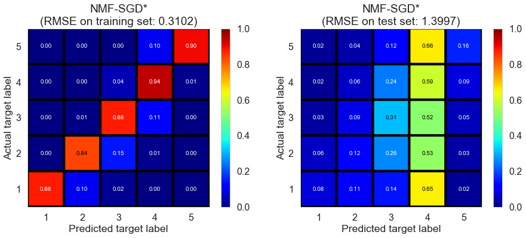
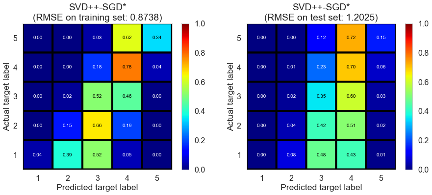
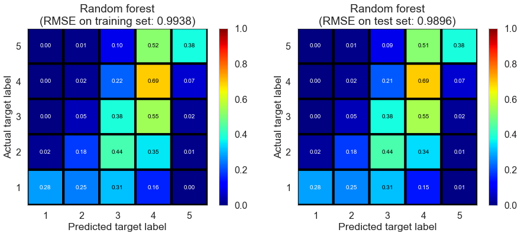
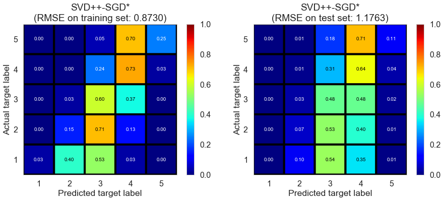
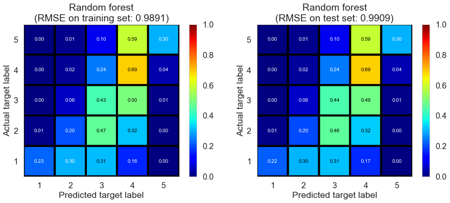
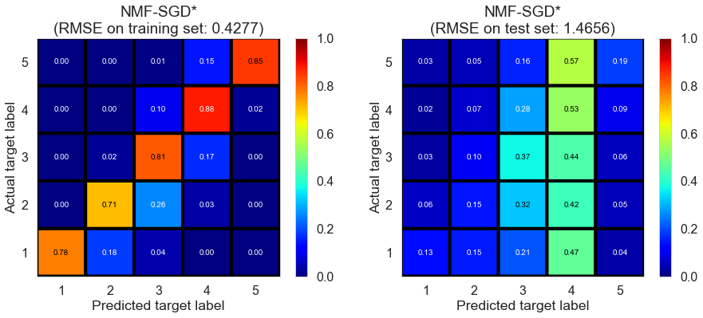

## Contents
{:.no_toc}
*  
{: toc}

## Methods

We benchmarked the base estimators and ensemble estimators in 6 datasets of different sizes. In each dataset, we randomly split the reviews into 3 sets: a training set (60%), a cross-validation set (16%) and a test set (24%). We train base estimators on the training set, and test on the test set; cross-validation set is used for the training of ensemble estimators. All experiments are run on a desktop with Inter Xeon CPU 3.10 GHz, 256 GB RAM.
  

## Results

### Champaign (20571 reviews, 878 restaurants, 8451 users)

<table  class="dataframe">
  <thead>
    <tr style="text-align: left;">
      <th>Collaborative filtering</th>
      <th>fitting time (s)</th>
      <th>train RMSE</th>
      <th>test RMSE</th>
      <th>train $R^2$</th>
      <th>test $R^2$</th>
    </tr>
  </thead>
  <tbody>
    <tr>
      <td>Mode estimator</td>
      <td>0.0000</td>
      <td>1.9995</td>
      <td>2.0258</td>
      <td>-0.9501</td>
      <td>-0.9500</td>
    </tr>
    <tr>
      <td>Normal predictor*</td>
      <td>0.0870</td>
      <td>1.8825</td>
      <td>1.8821</td>
      <td>-0.7286</td>
      <td>-0.6833</td>
    </tr>
    <tr>
      <td>Baseline (mean)</td>
      <td>0.0190</td>
      <td>0.9485</td>
      <td>1.4648</td>
      <td>0.5612</td>
      <td>-0.0195</td>
    </tr>
    <tr>
      <td>Baseline (regression)</td>
      <td>0.0350</td>
      <td>1.0481</td>
      <td>1.3032</td>
      <td>0.4642</td>
      <td>0.1930</td>
    </tr>
    <tr>
      <td>Baseline (ALS)*</td>
      <td>0.0570</td>
      <td>1.1981</td>
      <td>1.3200</td>
      <td>0.2998</td>
      <td>0.1721</td>
    </tr>
    <tr>
      <td>KNN (basic)*</td>
      <td>0.9841</td>
      <td>0.4328</td>
      <td>1.4642</td>
      <td>0.9086</td>
      <td>-0.0187</td>
    </tr>
    <tr>
      <td>KNN (with means)*</td>
      <td>1.2851</td>
      <td>0.5898</td>
      <td>1.5310</td>
      <td>0.8303</td>
      <td>-0.1138</td>
    </tr>
    <tr>
      <td>KNN (baseline)*</td>
      <td>1.0201</td>
      <td>0.4175</td>
      <td>1.3718</td>
      <td>0.9150</td>
      <td>0.1058</td>
    </tr>
    <tr>
      <td>SVD-ALS1</td>
      <td>12.2077</td>
      <td>0.6747</td>
      <td>1.3064</td>
      <td>0.7780</td>
      <td>0.1891</td>
    </tr>
    <tr>
      <td>SVD-ALS2</td>
      <td>12.9087</td>
      <td>0.6764</td>
      <td>1.3092</td>
      <td>0.7768</td>
      <td>0.1855</td>
    </tr>
    <tr>
      <td>SVD-SGD*</td>
      <td>1.0721</td>
      <td>0.8929</td>
      <td>1.3173</td>
      <td>0.6111</td>
      <td>0.1754</td>
    </tr>
    <tr>
      <td>SVD++-SGD*</td>
      <td>3.2642</td>
      <td>0.9285</td>
      <td>1.3220</td>
      <td>0.5795</td>
      <td>0.1695</td>
    </tr>
    <tr>
      <td>NMF-SGD*</td>
      <td>1.1601</td>
      <td>0.2485</td>
      <td>1.5226</td>
      <td>0.9699</td>
      <td>-0.1016</td>
    </tr>
    <tr>
      <td>Slope one*</td>
      <td>0.1530</td>
      <td>0.3545</td>
      <td>1.5546</td>
      <td>0.9387</td>
      <td>-0.1484</td>
    </tr>
    <tr>
      <td>Co-clustering*</td>
      <td>1.2161</td>
      <td>0.8066</td>
      <td>1.4792</td>
      <td>0.6826</td>
      <td>-0.0398</td>
    </tr>
  </tbody>
</table>

(* shows the algorithms we implemented by wrapping around     methods in scikit-surprise python package)

<table  class="dataframe">
  <thead>
    <tr style="text-align: left;">
      <th>Content filtering</th>
      <th>fitting time (s)</th>
      <th>train RMSE</th>
      <th>test RMSE</th>
      <th>train $R^2$</th>
      <th>test $R^2$</th>
    </tr>
  </thead>
  <tbody>
    <tr>
      <td>Ridge regression</td>
      <td>0.0690</td>
      <td>1.0773</td>
      <td>1.0971</td>
      <td>0.4339</td>
      <td>0.4280</td>
    </tr>
    <tr>
      <td>Random forest</td>
      <td>1.0951</td>
      <td>1.0262</td>
      <td>1.0862</td>
      <td>0.4864</td>
      <td>0.4394</td>
    </tr>
  </tbody>
</table>

<table  class="dataframe">
  <thead>
    <tr style="text-align: left;">
      <th>Ensemble estimators</th>
      <th>fitting time (s)</th>
      <th>train RMSE</th>
      <th>test RMSE</th>
      <th>train $R^2$</th>
      <th>test $R^2$</th>
    </tr>
  </thead>
  <tbody>
    <tr>
      <td>Ensemble1 (weighted average)</td>
      <td>0.000</td>
      <td>0.8527</td>
      <td>1.3071</td>
      <td>0.6454</td>
      <td>0.1882</td>
    </tr>
    <tr>
      <td>Ensemble1 (Ridge regression)</td>
      <td>0.011</td>
      <td>1.3268</td>
      <td>1.3026</td>
      <td>0.1413</td>
      <td>0.1937</td>
    </tr>
    <tr>
      <td>Ensemble1 (random forest)</td>
      <td>0.220</td>
      <td>1.0506</td>
      <td>1.3048</td>
      <td>0.4617</td>
      <td>0.1910</td>
    </tr>
    <tr>
      <td>Ensemble2 (weighted average)</td>
      <td>0.000</td>
      <td>0.9007</td>
      <td>1.1591</td>
      <td>0.6043</td>
      <td>0.3616</td>
    </tr>
    <tr>
      <td>Ensemble2 (Ridge regression)</td>
      <td>0.004</td>
      <td>1.2721</td>
      <td>1.0830</td>
      <td>0.2107</td>
      <td>0.4426</td>
    </tr>
    <tr>
      <td>Ensemble2 (random forest)</td>
      <td>0.271</td>
      <td>1.0678</td>
      <td>1.0847</td>
      <td>0.4439</td>
      <td>0.4409</td>
    </tr>
  </tbody>
</table>

(Ensemble1 represents the ensemble of collaborative filtering models;     Ensemble2 represents the ensemble of collaborative filtering and content filtering models)

    

    

    

    

    

    

    

    

    

    

    

    

    

    

    

    

    

    

    

    

    

    

    

  

### Cleveland (75932 reviews, 2500 restaurants, 30131 users)

<table  class="dataframe">
  <thead>
    <tr style="text-align: left;">
      <th>Collaborative filtering</th>
      <th>fitting time (s)</th>
      <th>train RMSE</th>
      <th>test RMSE</th>
      <th>train $R^2$</th>
      <th>test $R^2$</th>
    </tr>
  </thead>
  <tbody>
    <tr>
      <td>Mode estimator</td>
      <td>0.0000</td>
      <td>1.8152</td>
      <td>1.8262</td>
      <td>-0.8226</td>
      <td>-0.8371</td>
    </tr>
    <tr>
      <td>Normal predictor*</td>
      <td>0.2250</td>
      <td>1.7514</td>
      <td>1.7529</td>
      <td>-0.6968</td>
      <td>-0.6926</td>
    </tr>
    <tr>
      <td>Baseline (mean)</td>
      <td>0.0550</td>
      <td>0.8908</td>
      <td>1.3417</td>
      <td>0.5610</td>
      <td>0.0084</td>
    </tr>
    <tr>
      <td>Baseline (regression)</td>
      <td>0.1110</td>
      <td>0.9870</td>
      <td>1.2051</td>
      <td>0.4611</td>
      <td>0.2000</td>
    </tr>
    <tr>
      <td>Baseline (ALS)*</td>
      <td>0.2790</td>
      <td>1.1171</td>
      <td>1.2170</td>
      <td>0.3097</td>
      <td>0.1841</td>
    </tr>
    <tr>
      <td>KNN (basic)*</td>
      <td>13.4688</td>
      <td>0.3952</td>
      <td>1.3484</td>
      <td>0.9136</td>
      <td>-0.0016</td>
    </tr>
    <tr>
      <td>KNN (with means)*</td>
      <td>14.3168</td>
      <td>0.5600</td>
      <td>1.4020</td>
      <td>0.8265</td>
      <td>-0.0829</td>
    </tr>
    <tr>
      <td>KNN (baseline)*</td>
      <td>13.0127</td>
      <td>0.3837</td>
      <td>1.2612</td>
      <td>0.9186</td>
      <td>0.1237</td>
    </tr>
    <tr>
      <td>SVD-ALS1</td>
      <td>41.9954</td>
      <td>0.5721</td>
      <td>1.2095</td>
      <td>0.8190</td>
      <td>0.1941</td>
    </tr>
    <tr>
      <td>SVD-ALS2</td>
      <td>44.2825</td>
      <td>0.5740</td>
      <td>1.2121</td>
      <td>0.8177</td>
      <td>0.1907</td>
    </tr>
    <tr>
      <td>SVD-SGD*</td>
      <td>3.8932</td>
      <td>0.8239</td>
      <td>1.2204</td>
      <td>0.6245</td>
      <td>0.1796</td>
    </tr>
    <tr>
      <td>SVD++-SGD*</td>
      <td>15.5919</td>
      <td>0.8628</td>
      <td>1.2232</td>
      <td>0.5882</td>
      <td>0.1758</td>
    </tr>
    <tr>
      <td>NMF-SGD*</td>
      <td>4.6793</td>
      <td>0.3102</td>
      <td>1.3997</td>
      <td>0.9468</td>
      <td>-0.0793</td>
    </tr>
    <tr>
      <td>Slope one*</td>
      <td>0.7920</td>
      <td>0.3622</td>
      <td>1.4140</td>
      <td>0.9274</td>
      <td>-0.1013</td>
    </tr>
    <tr>
      <td>Co-clustering*</td>
      <td>4.3442</td>
      <td>0.7050</td>
      <td>1.3656</td>
      <td>0.7251</td>
      <td>-0.0273</td>
    </tr>
  </tbody>
</table>

(* shows the algorithms we implemented by wrapping around     methods in scikit-surprise python package)

<table  class="dataframe">
  <thead>
    <tr style="text-align: left;">
      <th>Content filtering</th>
      <th>fitting time (s)</th>
      <th>train RMSE</th>
      <th>test RMSE</th>
      <th>train $R^2$</th>
      <th>test $R^2$</th>
    </tr>
  </thead>
  <tbody>
    <tr>
      <td>Ridge regression</td>
      <td>0.2860</td>
      <td>1.0195</td>
      <td>1.0313</td>
      <td>0.4251</td>
      <td>0.4141</td>
    </tr>
    <tr>
      <td>Random forest</td>
      <td>4.7943</td>
      <td>0.9929</td>
      <td>1.0155</td>
      <td>0.4546</td>
      <td>0.4320</td>
    </tr>
  </tbody>
</table>

<table  class="dataframe">
  <thead>
    <tr style="text-align: left;">
      <th>Ensemble estimators</th>
      <th>fitting time (s)</th>
      <th>train RMSE</th>
      <th>test RMSE</th>
      <th>train $R^2$</th>
      <th>test $R^2$</th>
    </tr>
  </thead>
  <tbody>
    <tr>
      <td>Ensemble1 (weighted average)</td>
      <td>0.0000</td>
      <td>0.7559</td>
      <td>1.2085</td>
      <td>0.6839</td>
      <td>0.1955</td>
    </tr>
    <tr>
      <td>Ensemble1 (Ridge regression)</td>
      <td>0.0050</td>
      <td>0.9587</td>
      <td>1.2040</td>
      <td>0.4916</td>
      <td>0.2014</td>
    </tr>
    <tr>
      <td>Ensemble1 (random forest)</td>
      <td>0.7260</td>
      <td>0.9431</td>
      <td>1.2063</td>
      <td>0.5080</td>
      <td>0.1984</td>
    </tr>
    <tr>
      <td>Ensemble2 (weighted average)</td>
      <td>0.0000</td>
      <td>0.8214</td>
      <td>1.0915</td>
      <td>0.6268</td>
      <td>0.3437</td>
    </tr>
    <tr>
      <td>Ensemble2 (Ridge regression)</td>
      <td>0.0070</td>
      <td>1.0072</td>
      <td>1.0141</td>
      <td>0.4389</td>
      <td>0.4334</td>
    </tr>
    <tr>
      <td>Ensemble2 (random forest)</td>
      <td>0.9471</td>
      <td>0.9989</td>
      <td>1.0180</td>
      <td>0.4480</td>
      <td>0.4291</td>
    </tr>
  </tbody>
</table>

(Ensemble1 represents the ensemble of collaborative filtering models;     Ensemble2 represents the ensemble of collaborative filtering and content filtering models)

    

    

    

    

    

    

    

    

    

    

    

    

    

    

    

    

    

    

    

    

    

    

    

  

### Pittsburgh (143682 reviews, 4745 restaurants, 46179 users)

<table  class="dataframe">
  <thead>
    <tr style="text-align: left;">
      <th>Collaborative filtering</th>
      <th>fitting time (s)</th>
      <th>train RMSE</th>
      <th>test RMSE</th>
      <th>train $R^2$</th>
      <th>test $R^2$</th>
    </tr>
  </thead>
  <tbody>
    <tr>
      <td>Mode estimator</td>
      <td>0.0000</td>
      <td>1.8026</td>
      <td>1.7988</td>
      <td>-0.8466</td>
      <td>-0.8393</td>
    </tr>
    <tr>
      <td>Normal predictor*</td>
      <td>0.4550</td>
      <td>1.7307</td>
      <td>1.7303</td>
      <td>-0.7022</td>
      <td>-0.7017</td>
    </tr>
    <tr>
      <td>Baseline (mean)</td>
      <td>0.1020</td>
      <td>0.9052</td>
      <td>1.3198</td>
      <td>0.5343</td>
      <td>0.0099</td>
    </tr>
    <tr>
      <td>Baseline (regression)</td>
      <td>0.2000</td>
      <td>0.9941</td>
      <td>1.1878</td>
      <td>0.4384</td>
      <td>0.1980</td>
    </tr>
    <tr>
      <td>Baseline (ALS)*</td>
      <td>0.5780</td>
      <td>1.1119</td>
      <td>1.2020</td>
      <td>0.2974</td>
      <td>0.1788</td>
    </tr>
    <tr>
      <td>SVD-ALS1</td>
      <td>79.5536</td>
      <td>0.5627</td>
      <td>1.1960</td>
      <td>0.8200</td>
      <td>0.1870</td>
    </tr>
    <tr>
      <td>SVD-ALS2</td>
      <td>82.5507</td>
      <td>0.5651</td>
      <td>1.2010</td>
      <td>0.8185</td>
      <td>0.1801</td>
    </tr>
    <tr>
      <td>SVD-SGD*</td>
      <td>7.5524</td>
      <td>0.8267</td>
      <td>1.2046</td>
      <td>0.6116</td>
      <td>0.1752</td>
    </tr>
    <tr>
      <td>SVD++-SGD*</td>
      <td>43.6945</td>
      <td>0.8738</td>
      <td>1.2025</td>
      <td>0.5661</td>
      <td>0.1780</td>
    </tr>
    <tr>
      <td>NMF-SGD*</td>
      <td>9.3785</td>
      <td>0.3666</td>
      <td>1.3761</td>
      <td>0.9236</td>
      <td>-0.0765</td>
    </tr>
    <tr>
      <td>Slope one*</td>
      <td>1.8091</td>
      <td>0.3685</td>
      <td>1.3870</td>
      <td>0.9228</td>
      <td>-0.0935</td>
    </tr>
    <tr>
      <td>Co-clustering*</td>
      <td>7.8524</td>
      <td>0.7938</td>
      <td>1.3291</td>
      <td>0.6419</td>
      <td>-0.0041</td>
    </tr>
  </tbody>
</table>

(* shows the algorithms we implemented by wrapping around     methods in scikit-surprise python package)

<table  class="dataframe">
  <thead>
    <tr style="text-align: left;">
      <th>Content filtering</th>
      <th>fitting time (s)</th>
      <th>train RMSE</th>
      <th>test RMSE</th>
      <th>train $R^2$</th>
      <th>test $R^2$</th>
    </tr>
  </thead>
  <tbody>
    <tr>
      <td>Ridge regression</td>
      <td>0.5500</td>
      <td>1.0158</td>
      <td>1.0062</td>
      <td>0.4135</td>
      <td>0.4245</td>
    </tr>
    <tr>
      <td>Random forest</td>
      <td>10.1126</td>
      <td>0.9938</td>
      <td>0.9896</td>
      <td>0.4388</td>
      <td>0.4434</td>
    </tr>
  </tbody>
</table>

<table  class="dataframe">
  <thead>
    <tr style="text-align: left;">
      <th>Ensemble estimators</th>
      <th>fitting time (s)</th>
      <th>train RMSE</th>
      <th>test RMSE</th>
      <th>train $R^2$</th>
      <th>test $R^2$</th>
    </tr>
  </thead>
  <tbody>
    <tr>
      <td>Ensemble1 (weighted average)</td>
      <td>0.0000</td>
      <td>0.8050</td>
      <td>1.1919</td>
      <td>0.6317</td>
      <td>0.1925</td>
    </tr>
    <tr>
      <td>Ensemble1 (Ridge regression)</td>
      <td>0.0150</td>
      <td>0.9371</td>
      <td>1.1872</td>
      <td>0.5010</td>
      <td>0.1988</td>
    </tr>
    <tr>
      <td>Ensemble1 (random forest)</td>
      <td>1.2871</td>
      <td>0.9703</td>
      <td>1.1882</td>
      <td>0.4650</td>
      <td>0.1974</td>
    </tr>
    <tr>
      <td>Ensemble2 (weighted average)</td>
      <td>0.0000</td>
      <td>0.8576</td>
      <td>1.0612</td>
      <td>0.5820</td>
      <td>0.3598</td>
    </tr>
    <tr>
      <td>Ensemble2 (Ridge regression)</td>
      <td>0.0170</td>
      <td>0.9494</td>
      <td>0.9882</td>
      <td>0.4878</td>
      <td>0.4449</td>
    </tr>
    <tr>
      <td>Ensemble2 (random forest)</td>
      <td>1.7071</td>
      <td>0.9996</td>
      <td>0.9933</td>
      <td>0.4322</td>
      <td>0.4391</td>
    </tr>
  </tbody>
</table>

(Ensemble1 represents the ensemble of collaborative filtering models;     Ensemble2 represents the ensemble of collaborative filtering and content filtering models)

    

    

    

    

    

    

    

    

    

    

    

    

    

    

    

    

    

    

    

    

  

### Toronto (331407 reviews, 12118 restaurants, 77506 users)

<table  class="dataframe">
  <thead>
    <tr style="text-align: left;">
      <th>Collaborative filtering</th>
      <th>fitting time (s)</th>
      <th>train RMSE</th>
      <th>test RMSE</th>
      <th>train $R^2$</th>
      <th>test $R^2$</th>
    </tr>
  </thead>
  <tbody>
    <tr>
      <td>Mode estimator</td>
      <td>0.0000</td>
      <td>1.8830</td>
      <td>1.8801</td>
      <td>-1.1173</td>
      <td>-1.1219</td>
    </tr>
    <tr>
      <td>Normal predictor*</td>
      <td>1.0181</td>
      <td>1.7034</td>
      <td>1.7099</td>
      <td>-0.7326</td>
      <td>-0.7552</td>
    </tr>
    <tr>
      <td>Baseline (mean)</td>
      <td>0.2360</td>
      <td>0.9293</td>
      <td>1.2911</td>
      <td>0.4843</td>
      <td>-0.0006</td>
    </tr>
    <tr>
      <td>Baseline (regression)</td>
      <td>0.6270</td>
      <td>0.9918</td>
      <td>1.1624</td>
      <td>0.4126</td>
      <td>0.1890</td>
    </tr>
    <tr>
      <td>Baseline (ALS)*</td>
      <td>1.6651</td>
      <td>1.0916</td>
      <td>1.1730</td>
      <td>0.2884</td>
      <td>0.1740</td>
    </tr>
    <tr>
      <td>SVD-ALS1</td>
      <td>168.3716</td>
      <td>0.5614</td>
      <td>1.1751</td>
      <td>0.8118</td>
      <td>0.1711</td>
    </tr>
    <tr>
      <td>SVD-ALS2</td>
      <td>169.0347</td>
      <td>0.5634</td>
      <td>1.1795</td>
      <td>0.8104</td>
      <td>0.1649</td>
    </tr>
    <tr>
      <td>SVD-SGD*</td>
      <td>17.6360</td>
      <td>0.8222</td>
      <td>1.1772</td>
      <td>0.5963</td>
      <td>0.1681</td>
    </tr>
    <tr>
      <td>SVD++-SGD*</td>
      <td>119.8469</td>
      <td>0.8730</td>
      <td>1.1763</td>
      <td>0.5449</td>
      <td>0.1694</td>
    </tr>
    <tr>
      <td>NMF-SGD*</td>
      <td>22.2953</td>
      <td>0.4094</td>
      <td>1.3369</td>
      <td>0.8999</td>
      <td>-0.0729</td>
    </tr>
    <tr>
      <td>Slope one*</td>
      <td>7.2904</td>
      <td>0.2959</td>
      <td>1.3718</td>
      <td>0.9477</td>
      <td>-0.1296</td>
    </tr>
    <tr>
      <td>Co-clustering*</td>
      <td>17.0870</td>
      <td>0.8344</td>
      <td>1.2936</td>
      <td>0.5842</td>
      <td>-0.0045</td>
    </tr>
  </tbody>
</table>

(* shows the algorithms we implemented by wrapping around     methods in scikit-surprise python package)

<table  class="dataframe">
  <thead>
    <tr style="text-align: left;">
      <th>Content filtering</th>
      <th>fitting time (s)</th>
      <th>train RMSE</th>
      <th>test RMSE</th>
      <th>train $R^2$</th>
      <th>test $R^2$</th>
    </tr>
  </thead>
  <tbody>
    <tr>
      <td>Ridge regression</td>
      <td>1.1401</td>
      <td>1.0049</td>
      <td>1.0035</td>
      <td>0.3970</td>
      <td>0.3955</td>
    </tr>
    <tr>
      <td>Random forest</td>
      <td>27.0035</td>
      <td>0.9891</td>
      <td>0.9909</td>
      <td>0.4158</td>
      <td>0.4106</td>
    </tr>
  </tbody>
</table>

<table  class="dataframe">
  <thead>
    <tr style="text-align: left;">
      <th>Ensemble estimators</th>
      <th>fitting time (s)</th>
      <th>train RMSE</th>
      <th>test RMSE</th>
      <th>train $R^2$</th>
      <th>test $R^2$</th>
    </tr>
  </thead>
  <tbody>
    <tr>
      <td>Ensemble1 (weighted average)</td>
      <td>0.0000</td>
      <td>0.8044</td>
      <td>1.1661</td>
      <td>0.6136</td>
      <td>0.1837</td>
    </tr>
    <tr>
      <td>Ensemble1 (Ridge regression)</td>
      <td>0.0290</td>
      <td>1.0152</td>
      <td>1.1620</td>
      <td>0.3845</td>
      <td>0.1895</td>
    </tr>
    <tr>
      <td>Ensemble1 (random forest)</td>
      <td>3.2312</td>
      <td>0.9977</td>
      <td>1.1637</td>
      <td>0.4056</td>
      <td>0.1872</td>
    </tr>
    <tr>
      <td>Ensemble2 (weighted average)</td>
      <td>0.0000</td>
      <td>0.8564</td>
      <td>1.0542</td>
      <td>0.5620</td>
      <td>0.3329</td>
    </tr>
    <tr>
      <td>Ensemble2 (Ridge regression)</td>
      <td>0.0390</td>
      <td>1.0111</td>
      <td>0.9879</td>
      <td>0.3895</td>
      <td>0.4141</td>
    </tr>
    <tr>
      <td>Ensemble2 (random forest)</td>
      <td>4.1512</td>
      <td>0.9948</td>
      <td>0.9962</td>
      <td>0.4090</td>
      <td>0.4043</td>
    </tr>
  </tbody>
</table>

(Ensemble1 represents the ensemble of collaborative filtering models;     Ensemble2 represents the ensemble of collaborative filtering and content filtering models)

    

    

    

    

    

    

    

    

    

    

    

    

    

    

    

    

    

    

    

    

  

### Las_Vegas (1280896 reviews, 20434 restaurants, 429363 users)

<table  class="dataframe">
  <thead>
    <tr style="text-align: left;">
      <th>Collaborative filtering</th>
      <th>fitting time (s)</th>
      <th>train RMSE</th>
      <th>test RMSE</th>
      <th>train $R^2$</th>
      <th>test $R^2$</th>
    </tr>
  </thead>
  <tbody>
    <tr>
      <td>Mode estimator</td>
      <td>0.0000</td>
      <td>1.9060</td>
      <td>1.9073</td>
      <td>-0.7549</td>
      <td>-0.7578</td>
    </tr>
    <tr>
      <td>Normal predictor*</td>
      <td>5.3933</td>
      <td>1.8565</td>
      <td>1.8573</td>
      <td>-0.6649</td>
      <td>-0.6667</td>
    </tr>
    <tr>
      <td>Baseline (mean)</td>
      <td>1.1371</td>
      <td>0.9990</td>
      <td>1.4148</td>
      <td>0.5179</td>
      <td>0.0329</td>
    </tr>
    <tr>
      <td>Baseline (regression)</td>
      <td>5.9963</td>
      <td>1.0732</td>
      <td>1.2612</td>
      <td>0.4436</td>
      <td>0.2314</td>
    </tr>
    <tr>
      <td>Baseline (ALS)*</td>
      <td>6.9174</td>
      <td>1.1880</td>
      <td>1.2696</td>
      <td>0.3182</td>
      <td>0.2211</td>
    </tr>
    <tr>
      <td>SVD-ALS1</td>
      <td>652.1173</td>
      <td>0.4264</td>
      <td>1.2794</td>
      <td>0.9122</td>
      <td>0.2091</td>
    </tr>
    <tr>
      <td>SVD-ALS2</td>
      <td>674.9286</td>
      <td>0.4283</td>
      <td>1.2862</td>
      <td>0.9114</td>
      <td>0.2007</td>
    </tr>
    <tr>
      <td>SVD-SGD*</td>
      <td>70.6220</td>
      <td>0.7758</td>
      <td>1.2827</td>
      <td>0.7093</td>
      <td>0.2050</td>
    </tr>
    <tr>
      <td>SVD++-SGD*</td>
      <td>333.8711</td>
      <td>0.8046</td>
      <td>1.3020</td>
      <td>0.6873</td>
      <td>0.1809</td>
    </tr>
    <tr>
      <td>NMF-SGD*</td>
      <td>92.4893</td>
      <td>0.4178</td>
      <td>1.4916</td>
      <td>0.9157</td>
      <td>-0.0750</td>
    </tr>
    <tr>
      <td>Slope one*</td>
      <td>24.1324</td>
      <td>0.4314</td>
      <td>1.5076</td>
      <td>0.9101</td>
      <td>-0.0983</td>
    </tr>
    <tr>
      <td>Co-clustering*</td>
      <td>77.2254</td>
      <td>0.8555</td>
      <td>1.4343</td>
      <td>0.6464</td>
      <td>0.0060</td>
    </tr>
  </tbody>
</table>

(* shows the algorithms we implemented by wrapping around     methods in scikit-surprise python package)

<table  class="dataframe">
  <thead>
    <tr style="text-align: left;">
      <th>Content filtering</th>
      <th>fitting time (s)</th>
      <th>train RMSE</th>
      <th>test RMSE</th>
      <th>train $R^2$</th>
      <th>test $R^2$</th>
    </tr>
  </thead>
  <tbody>
    <tr>
      <td>Ridge regression</td>
      <td>5.0093</td>
      <td>1.1216</td>
      <td>1.1226</td>
      <td>0.3923</td>
      <td>0.3911</td>
    </tr>
    <tr>
      <td>Random forest</td>
      <td>154.2278</td>
      <td>1.1008</td>
      <td>1.1029</td>
      <td>0.4146</td>
      <td>0.4122</td>
    </tr>
  </tbody>
</table>

<table  class="dataframe">
  <thead>
    <tr style="text-align: left;">
      <th>Ensemble estimators</th>
      <th>fitting time (s)</th>
      <th>train RMSE</th>
      <th>test RMSE</th>
      <th>train $R^2$</th>
      <th>test $R^2$</th>
    </tr>
  </thead>
  <tbody>
    <tr>
      <td>Ensemble1 (weighted average)</td>
      <td>0.0000</td>
      <td>0.7633</td>
      <td>1.2648</td>
      <td>0.7185</td>
      <td>0.2270</td>
    </tr>
    <tr>
      <td>Ensemble1 (Ridge regression)</td>
      <td>0.1270</td>
      <td>1.0514</td>
      <td>1.2600</td>
      <td>0.4660</td>
      <td>0.2329</td>
    </tr>
    <tr>
      <td>Ensemble1 (random forest)</td>
      <td>13.2948</td>
      <td>1.0838</td>
      <td>1.2617</td>
      <td>0.4326</td>
      <td>0.2308</td>
    </tr>
    <tr>
      <td>Ensemble2 (weighted average)</td>
      <td>0.0000</td>
      <td>0.8674</td>
      <td>1.1697</td>
      <td>0.6366</td>
      <td>0.3389</td>
    </tr>
    <tr>
      <td>Ensemble2 (Ridge regression)</td>
      <td>0.1520</td>
      <td>1.1144</td>
      <td>1.1016</td>
      <td>0.4001</td>
      <td>0.4136</td>
    </tr>
    <tr>
      <td>Ensemble2 (random forest)</td>
      <td>16.9300</td>
      <td>1.1061</td>
      <td>1.1082</td>
      <td>0.4090</td>
      <td>0.4066</td>
    </tr>
  </tbody>
</table>

(Ensemble1 represents the ensemble of collaborative filtering models;     Ensemble2 represents the ensemble of collaborative filtering and content filtering models)

    

    

    

    

    

    

    

    

    

    

    

    

    

    

    

    

    

    

    

    

  

### Full (4166778 reviews, 131025 restaurants, 1117891 users)

<table  class="dataframe">
  <thead>
    <tr style="text-align: left;">
      <th>Collaborative filtering</th>
      <th>fitting time (s)</th>
      <th>train RMSE</th>
      <th>test RMSE</th>
      <th>train $R^2$</th>
      <th>test $R^2$</th>
    </tr>
  </thead>
  <tbody>
    <tr>
      <td>Mode estimator</td>
      <td>0.0000</td>
      <td>1.8974</td>
      <td>1.8985</td>
      <td>-0.7803</td>
      <td>-0.7799</td>
    </tr>
    <tr>
      <td>Normal predictor*</td>
      <td>19.3631</td>
      <td>1.8394</td>
      <td>1.8405</td>
      <td>-0.6729</td>
      <td>-0.6727</td>
    </tr>
    <tr>
      <td>Baseline (mean)</td>
      <td>4.6053</td>
      <td>1.0178</td>
      <td>1.4063</td>
      <td>0.4878</td>
      <td>0.0234</td>
    </tr>
    <tr>
      <td>Baseline (regression)</td>
      <td>21.4822</td>
      <td>1.0642</td>
      <td>1.2529</td>
      <td>0.4400</td>
      <td>0.2248</td>
    </tr>
    <tr>
      <td>Baseline (ALS)*</td>
      <td>27.2096</td>
      <td>1.1754</td>
      <td>1.2659</td>
      <td>0.3169</td>
      <td>0.2086</td>
    </tr>
    <tr>
      <td>SVD-ALS1</td>
      <td>2153.7902</td>
      <td>0.5313</td>
      <td>1.2691</td>
      <td>0.8604</td>
      <td>0.2046</td>
    </tr>
    <tr>
      <td>SVD-ALS2</td>
      <td>2268.9128</td>
      <td>0.5332</td>
      <td>1.2756</td>
      <td>0.8594</td>
      <td>0.1965</td>
    </tr>
    <tr>
      <td>SVD-SGD*</td>
      <td>242.1499</td>
      <td>0.8312</td>
      <td>1.2721</td>
      <td>0.6584</td>
      <td>0.2008</td>
    </tr>
    <tr>
      <td>SVD++-SGD*</td>
      <td>1473.2923</td>
      <td>0.8713</td>
      <td>1.2784</td>
      <td>0.6246</td>
      <td>0.1930</td>
    </tr>
    <tr>
      <td>NMF-SGD*</td>
      <td>323.9235</td>
      <td>0.4277</td>
      <td>1.4656</td>
      <td>0.9095</td>
      <td>-0.0607</td>
    </tr>
  </tbody>
</table>

(* shows the algorithms we implemented by wrapping around     methods in scikit-surprise python package)

<table  class="dataframe">
  <thead>
    <tr style="text-align: left;">
      <th>Content filtering</th>
      <th>fitting time (s)</th>
      <th>train RMSE</th>
      <th>test RMSE</th>
      <th>train $R^2$</th>
      <th>test $R^2$</th>
    </tr>
  </thead>
  <tbody>
    <tr>
      <td>Ridge regression</td>
      <td>17.1610</td>
      <td>1.0857</td>
      <td>1.0869</td>
      <td>0.4171</td>
      <td>0.4167</td>
    </tr>
    <tr>
      <td>Random forest</td>
      <td>663.2849</td>
      <td>1.0639</td>
      <td>1.0653</td>
      <td>0.4403</td>
      <td>0.4396</td>
    </tr>
  </tbody>
</table>

<table  class="dataframe">
  <thead>
    <tr style="text-align: left;">
      <th>Ensemble estimators</th>
      <th>fitting time (s)</th>
      <th>train RMSE</th>
      <th>test RMSE</th>
      <th>train $R^2$</th>
      <th>test $R^2$</th>
    </tr>
  </thead>
  <tbody>
    <tr>
      <td>Ensemble1 (weighted average)</td>
      <td>0.0000</td>
      <td>0.8161</td>
      <td>1.2572</td>
      <td>0.6706</td>
      <td>0.2195</td>
    </tr>
    <tr>
      <td>Ensemble1 (Ridge regression)</td>
      <td>0.4160</td>
      <td>1.0550</td>
      <td>1.2520</td>
      <td>0.4496</td>
      <td>0.2260</td>
    </tr>
    <tr>
      <td>Ensemble1 (random forest)</td>
      <td>56.0282</td>
      <td>1.0652</td>
      <td>1.2542</td>
      <td>0.4389</td>
      <td>0.2233</td>
    </tr>
    <tr>
      <td>Ensemble2 (weighted average)</td>
      <td>0.0000</td>
      <td>0.8864</td>
      <td>1.1434</td>
      <td>0.6115</td>
      <td>0.3545</td>
    </tr>
    <tr>
      <td>Ensemble2 (Ridge regression)</td>
      <td>0.5530</td>
      <td>1.0865</td>
      <td>1.0623</td>
      <td>0.4163</td>
      <td>0.4427</td>
    </tr>
    <tr>
      <td>Ensemble2 (random forest)</td>
      <td>69.6950</td>
      <td>1.0689</td>
      <td>1.0703</td>
      <td>0.4351</td>
      <td>0.4343</td>
    </tr>
  </tbody>
</table>

(Ensemble1 represents the ensemble of collaborative filtering models;     Ensemble2 represents the ensemble of collaborative filtering and content filtering models)

    

    

    

    

    

    

    

    

    

    

    

    

    

    

    

    

    

    

  